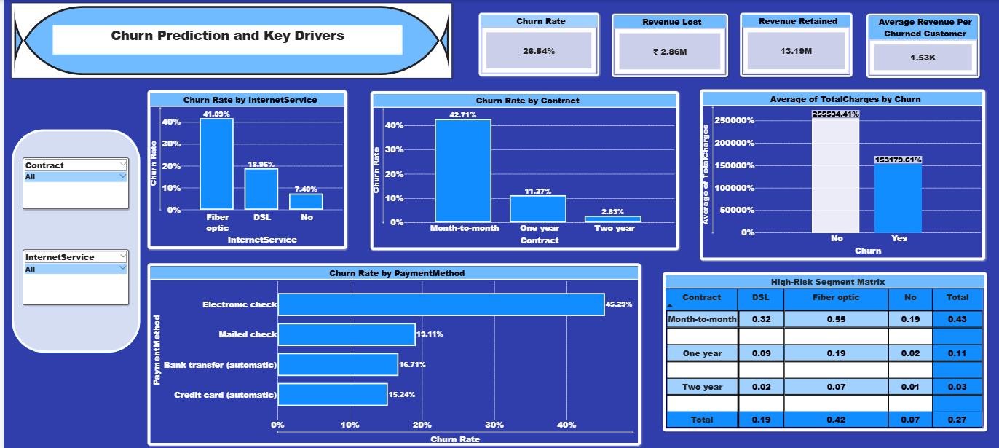

# 📊 Customer Churn Analysis

## 📌 Project Overview

This project focuses on analyzing telecom customer data from the **WA_Fn-UseC_-Telco-Customer-Churn** dataset to understand customer behavior, identify churn patterns, and derive actionable business insights. Using Power BI, interactive dashboards were created to visualize customer demographics, service usage, and billing trends.

---

## 🎯 Objectives

* Identify factors contributing to customer churn
* Segment customers based on behavior and services
* Analyze the impact of contract type, payment method, and services on churn
* Improve decision-making for customer retention strategies

---

## 📂 Dataset Description

The dataset **WA_Fn-UseC_-Telco-Customer-Churn** includes the following key attributes:

* Customer ID
* Gender
* Senior Citizen
* Tenure
* Contract Type
* Payment Method
* Internet Service
* Monthly Charges
* Total Charges
* Churn

---

## 📊 Key Insights

* Customers with **month-to-month contracts** have the highest churn rate
* **Fiber optic users** are more likely to churn
* Customers using **electronic check payment method** show higher churn
* Customers with **fewer services** have higher chances of leaving
* **New customers (low tenure)** are more prone to churn

---

## 📈 Dashboard Features

* Customer Demographics Analysis
* Churn Rate by Contract Type
* Churn Rate by Internet Service
* Churn by Payment Method
* Service Usage & Customer Engagement Analysis
* Key Driver Analysis for Churn

---

## 🛠️ Tools & Technologies

* Power BI (Data Visualization & Dashboarding)
* Excel / CSV (Data Source)
* Power Query (Data Cleaning & Transformation)
* DAX (Calculated Measures & Metrics)

---

## 🚀 How to Use

1. Download the `.pbix` file from the repository
2. Open it using Power BI Desktop
3. Use filters, slicers, and visuals to explore insights interactively

---

## 📌 Business Impact

* Helps telecom companies **reduce customer churn**
* Identifies **high-risk customer segments**
* Improves **targeted marketing strategies**
* Supports **data-driven decision making**

---

## 📷 Dashboard Preview 

---

## 🔮 Future Scope

* Add churn prediction using machine learning models
* Integrate real-time customer data
* Build automated alerts for high-risk customers

---

## 👩‍💻 Author

**Aditi Kodande**

📧 Email: (aditikodande9@gmail.com)
🔗 LinkedIn: (www.linkedin.com/in/aditi-kodande)

